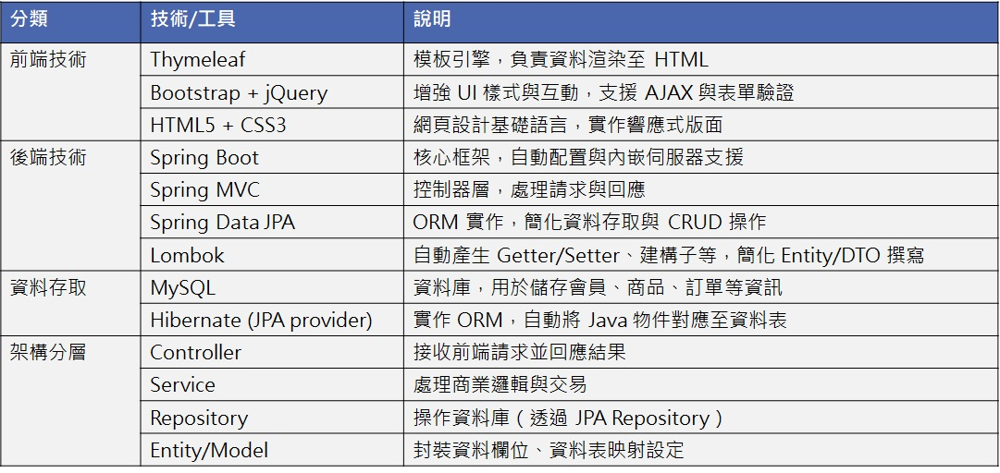
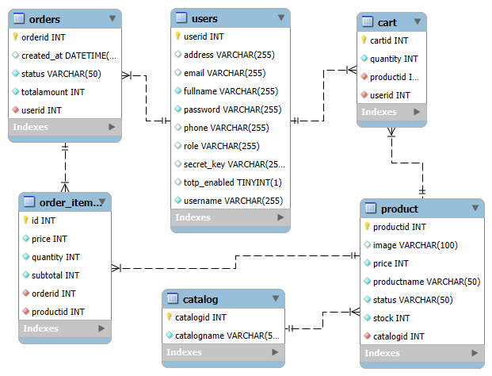

# 🛒 Shopeasy - Spring Boot 購物網站專案

# 📌 專案目的
本專案為一個以 Spring Boot 為核心架構，結合 Thymeleaf 前端模板引擎所開發的線上購物網站，主要目的是：

🧑‍💻 學習與實作 Spring Boot 分層架構（Controller / Service / Repository / Model） 

🛠️ 整合 Thymeleaf，實作前後端互動與表單處理 

🗂️ 實作完整資料表設計（user, catalog, product, cart, orders, order_item） 

🔐 實作用戶登入註冊與兩步驟驗證（Google Authenticator TOTP） 

🛍️ 支援購物車、訂單建立與明細紀錄 

📊 實作報表視覺化（Chart.js + jQuery） 

🧑‍💼 前台 / 後台管理分離設計（一般用戶與管理員功能區分） 

🖼️ 圖片上傳與圖片預覽功能整合 

# 🛍️ Shopeasy 專案介紹
Shopeasy 是一個基於 Spring Boot + Thymeleaf 的線上購物網站，支援會員註冊、登入、商品管理、購物車、訂單管理、二階段驗證與報表統計等功能。

# 🧱 系統架構
本專案採用典型的 Spring Boot 三層架構（Controller、Service、Repository）與 Thymeleaf 前端模板整合，並搭配以下技術：

## 📁 專案分層架構
src/main/java/com/example/shopeasy/  
├── config/           # 配置類（如 WebConfig）  
├── controller/       # 控制層 - 處理 HTTP 請求與頁面導向  
├── dto/              # DTO 層 - 資料傳輸物件（如 CartDTO） 
├── model/            # 資料模型 - 對應資料庫的 Entity  
├── repository/       # 資料存取層 - JPA Repository  
├── service/          # 服務層 - 商業邏輯處理  
└── util/             # 工具類 - 如 Google Auth 驗證工具  

src/main/resources/  
├── static/           # 靜態資源（CSS、JS、圖片） 
├── templates/        # Thymeleaf 模板 HTML  
└── application.properties  # 系統設定檔  

# 🔐 主要功能模組
會員管理:	註冊、登入、登出、二階段驗證、個人資訊修改  
商品管理:	商品新增、編輯、上傳圖片、前後台瀏覽  
購物車功能:	加入/移除商品、結帳功能  
訂單模組:	建立訂單、訂單明細查詢  
管理後台:	管理會員、訂單、商品、分類、報表  
視覺化報表:	圓餅圖、長條圖顯示用戶與訂單資訊  

# 🗃 資料庫設計（MySQL）

